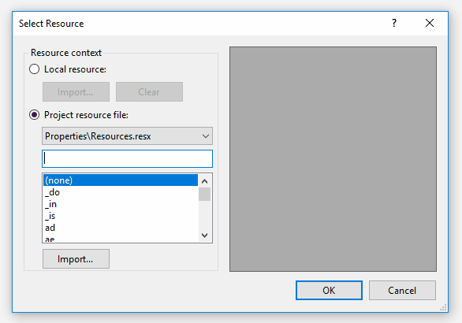

# Customize Select Resource Dialog in Windows Forms

Some times you have a lot of images in the resources and when trying to choose one for image of your control, it's hard to find the one which you want, because of having a lot of image in resources.

Here in this example, I've created a custom control and for its `BackgroundImage` property, I've modified the Resource select dialog to show a filter text box which you can use to searh between items of the list box.

The *Resource Select* dialog is a `UITypeEditor`. It is the internal class `ResourceEditorSwitch<T>` which internally uses the internal class `ResourcePickerDialog` and both of them are in `Microsoft.VisualStudio.Windows.Forms.dll` assembly which is one of Visual Studio's assemblies.

Since the implementation of the class is tightly coupled with some other internal classes of Visual Studio's assemblies, so it's hard to extract the class source code and customize it, but you having those information about the class will help us to take a look at its source code and let us to have more information about the class. 

To customize the *Resource Select* dialogInstead you can get an instance of the class at design time, and before showing the dialog, manipulate the dialog using code to have a filtering feature like following gif, *pay attention to the `TextBox` that I've added to the dialog:*

You can filter the `ListBox` by typing in `TextBox` and using <kbd>↑</kbd> and <kbd>↓</kbd> keys, without changing the focus from `TextBox` you can select filtered results.

